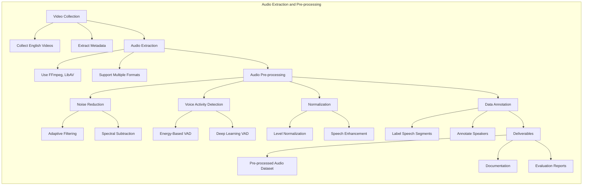
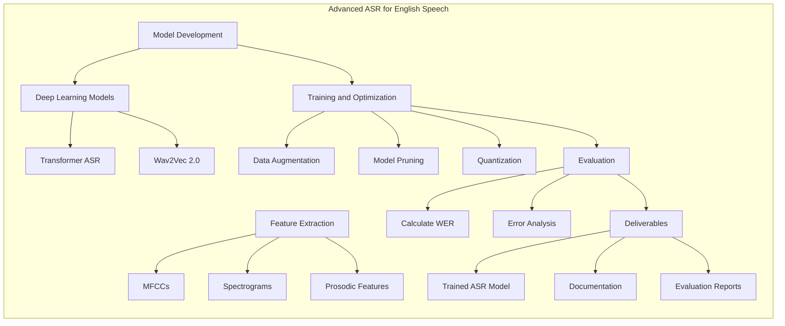
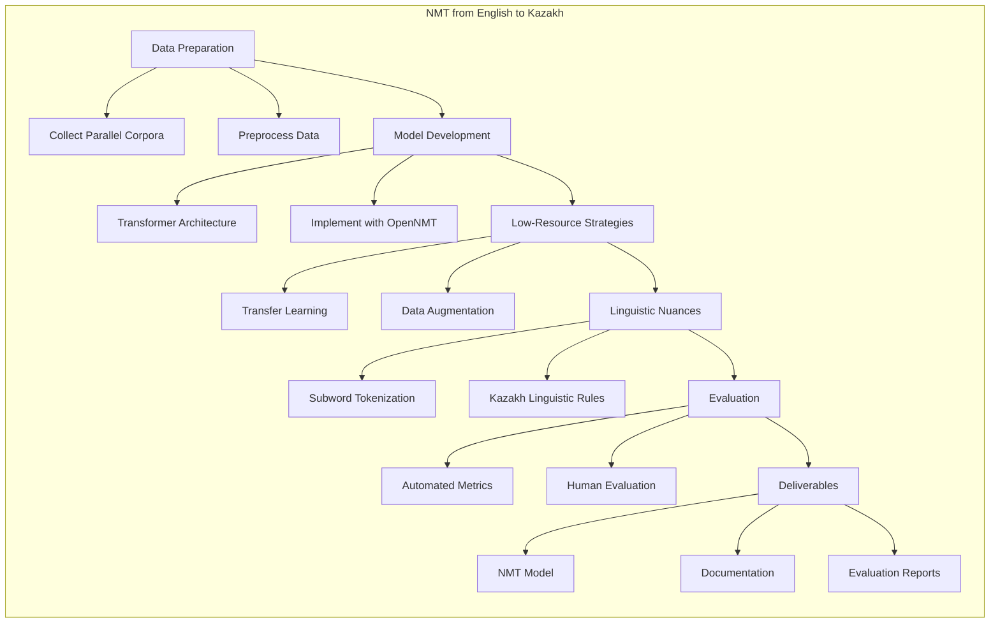
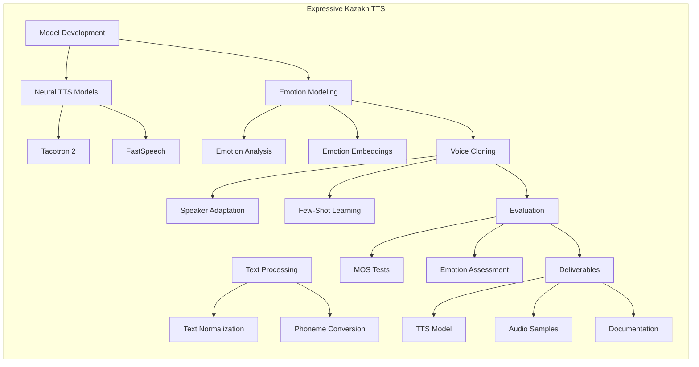
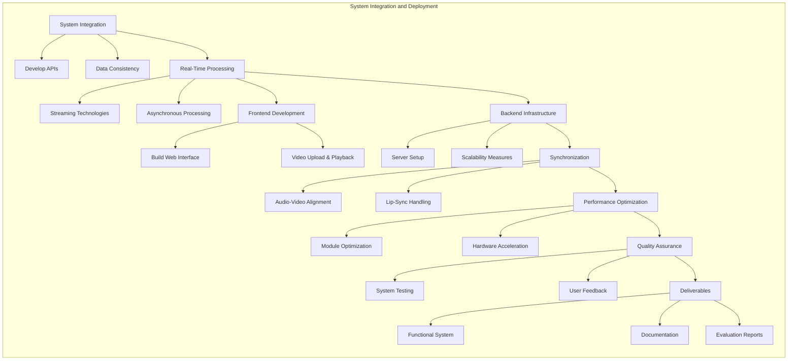

---

# **Comprehensive Project Plan: Top 5 Student Projects for a Real-Time Kazakh Speech Translation System**

---

## **Introduction**

To achieve the goal of developing a **real-time video translation system** that seamlessly translates any English video into **natural-sounding Kazakh speech with emotional expressiveness**, we have meticulously crafted a plan that divides the project into **five standalone yet interconnected sub-projects**. Each project is designed to be a significant research endeavor suitable for bachelor diploma topics and thesis defenses. The projects are structured to be completed within **5-6 months** by teams of **four students and a project manager**, utilizing **GitHub** for version control and **Trello** for task management.

**The five projects are:**

1. **Project 1:** Audio Extraction and Pre-processing
2. **Project 2:** Advanced Automatic Speech Recognition (ASR) for English Speech
3. **Project 3:** Neural Machine Translation (NMT) from English to Kazakh
4. **Project 4:** Natural and Expressive Text-to-Speech (TTS) Synthesis in Kazakh
5. **Project 5:** System Integration and Real-Time Deployment

Each project includes detailed steps, research topics, and diagrams to guide the students through development while ensuring each contributes to the final integrated system.

---

## **Project 1: Audio Extraction and Pre-processing**

### **Project Name:** **AudioPro: High-Quality Audio Extraction and Pre-processing for Video Translation**

### **Project Description:**

This project focuses on extracting high-quality audio from various video formats and pre-processing it to optimize for speech recognition tasks. It addresses challenges such as noise reduction, voice activity detection, and ensures that the audio is of sufficient quality for accurate ASR.

### **Key Objectives:**

- **Audio Extraction:** Extract audio from diverse video sources using tools like FFmpeg and LibAV.
- **Audio Separation:** Separate speech from background music and noise.
- **Format Conversion:** Convert audio to standardized formats (WAV, FLAC) with appropriate sample rates and bit depths.
- **Noise Reduction & Normalization:** Implement advanced noise reduction and normalization techniques to enhance audio quality.
- **Voice Activity Detection (VAD):** Develop robust algorithms to identify and isolate speech segments from non-speech segments.
- **Data Annotation:** Annotate audio data for training and evaluation purposes.

### **Detailed Steps:**

1. **Video Collection and Metadata Extraction:**

   - Collect a diverse set of English videos (e.g., BBC News, documentaries, interviews).
   - Extract metadata (title, duration, language, speaker information).

2. **Audio Extraction:**

   - Use tools like FFmpeg to extract audio tracks.
   - Support various video formats (MP4, MKV, AVI).

3. **Audio Pre-processing:**

   - **Noise Reduction:**
     - Apply adaptive filtering and spectral subtraction.
     - Use machine learning techniques for noise profiling.
   - **Voice Activity Detection (VAD):**
     - Implement energy-based, statistical, and deep learning-based VAD algorithms.
   - **Normalization and Enhancement:**
     - Normalize audio levels.
     - Enhance speech clarity and intelligibility.

4. **Data Annotation:**

   - Annotate speech segments, speakers, and background conditions.
   - Prepare datasets for training ASR models.

5. **Deliverables:**

   - High-quality pre-processed audio dataset.
   - Documentation of tools and methods used.
   - Evaluation reports on pre-processing effectiveness.

### **Mermaid Diagram:**

### **Research Topics:**

- **Advanced Noise Reduction Techniques:** Investigate and implement state-of-the-art noise reduction methods suitable for various audio conditions.
- **Robust Voice Activity Detection:** Develop VAD algorithms tailored to handle diverse speech patterns and background noises.
- **Impact on ASR Performance:** Analyze how pre-processing techniques affect the accuracy of speech recognition models.

---

## **Project 2: Advanced Automatic Speech Recognition (ASR) for English Speech**

### **Project Name:** **SpeechMaster: High-Accuracy ASR for English Video Content**

### **Project Description:**

This project aims to develop an advanced ASR system optimized for English speech in video content. The focus is on achieving high accuracy in transcribing speech, even in the presence of background noise and multiple speakers.

### **Key Objectives:**

- **Feature Extraction:** Extract and utilize advanced acoustic features for improved speech recognition.
- **Model Development:** Build a state-of-the-art ASR model using deep learning architectures.
- **Real-Time Processing:** Optimize the ASR system for low latency to enable real-time transcription.
- **Evaluation and Optimization:** Assess the ASR performance and fine-tune the model for maximum accuracy.

### **Detailed Steps:**

1. **Feature Extraction:**

   - Extract features like MFCCs, spectrograms, and prosodic features.
   - Implement feature normalization and dimensionality reduction techniques.

2. **Model Development:**

   - Use frameworks like TensorFlow or PyTorch.
   - Implement architectures such as Transformer ASR, DeepSpeech, or Wav2Vec 2.0.

3. **Training and Optimization:**

   - Train the ASR model using the pre-processed dataset from Project 1.
   - Apply data augmentation techniques to improve robustness.
   - Optimize for real-time inference using model pruning and quantization.

4. **Evaluation:**

   - Measure performance using metrics like Word Error Rate (WER) and Character Error Rate (CER).
   - Conduct error analysis to identify common misrecognitions.

5. **Deliverables:**

   - Trained ASR model with documentation.
   - Evaluation reports and error analysis.
   - Scripts and tools for real-time transcription.

### **Mermaid Diagram:**

### **Research Topics:**

- **Noise-Robust ASR Models:** Study the impact of background noise on ASR and develop methods to mitigate it.
- **Real-Time ASR Techniques:** Explore techniques to reduce latency in ASR systems.
- **Transfer Learning in ASR:** Utilize pre-trained models and fine-tune them for specific domains.

---

## **Project 3: Neural Machine Translation (NMT) from English to Kazakh**

### **Project Name:** **TransLingua: High-Quality NMT from English to Kazakh**

### **Project Description:**

This project focuses on developing an NMT system that can accurately translate English text into Kazakh. Special attention is given to handling the linguistic nuances of Kazakh, a low-resource language, and ensuring that translations are contextually and grammatically correct.

### **Key Objectives:**

- **Data Preparation:** Collect and preprocess bilingual corpora for training.
- **Model Development:** Build an NMT model using advanced architectures.
- **Addressing Low-Resource Challenges:** Implement strategies to overcome data scarcity.
- **Evaluation:** Assess translation quality using automated metrics and human evaluations.

### **Detailed Steps:**

1. **Data Collection and Pre-processing:**

   - Gather parallel English-Kazakh text data from various sources.
   - Clean, tokenize, and normalize the text data.

2. **Model Development:**

   - Use frameworks like OpenNMT or Fairseq.
   - Implement Transformer-based architectures.

3. **Overcoming Low-Resource Challenges:**

   - Apply transfer learning by fine-tuning multilingual pre-trained models (e.g., mBART, mT5).
   - Use data augmentation techniques like back-translation.

4. **Handling Linguistic Nuances:**

   - Address morphological complexity using subword tokenization (BPE).
   - Incorporate linguistic rules specific to Kazakh.

5. **Evaluation:**

   - Use BLEU, METEOR, and TER metrics.
   - Conduct human evaluations for fluency and adequacy.

6. **Deliverables:**

   - Trained NMT model.
   - Documentation of the translation pipeline and methodologies.
   - Evaluation reports and translation examples.

### **Mermaid Diagram:**

### **Research Topics:**

- **Improving NMT for Low-Resource Languages:** Explore effective methods to enhance translation quality with limited data.
- **Transfer Learning Applications:** Assess the benefits of using multilingual pre-trained models.
- **Morphological Analysis in NMT:** Investigate techniques to handle complex word formations.

---

## **Project 4: Natural and Expressive Text-to-Speech (TTS) Synthesis in Kazakh**

### **Project Name:** **VocaKaz: Natural and Emotionally Expressive Kazakh TTS**

### **Project Description:**

This project aims to develop a TTS system that generates natural and emotionally expressive Kazakh speech. The goal is to synthesize speech that not only sounds natural but also conveys emotions, matching the pitch and intonation of the original speaker.

### **Key Objectives:**

- **Text Processing:** Implement text normalization and phonetic conversion tailored to the Kazakh language.
- **Model Development:** Build a TTS model using neural architectures capable of expressing emotions.
- **Emotion Modeling:** Integrate emotional expressiveness into speech synthesis.
- **Voice Cloning:** Develop techniques to replicate voice characteristics for personalized speech.

### **Detailed Steps:**

1. **Text Processing:**

   - Normalize text and handle special cases (numbers, dates).
   - Convert text to phonemes using Kazakh pronunciation rules.

2. **Model Development:**

   - Use neural TTS models like Tacotron 2 or FastSpeech.
   - Implement prosody modeling for natural intonation.

3. **Emotion Modeling:**

   - Analyze emotional cues from the source text or audio.
   - Integrate emotion embeddings into the TTS model.

4. **Voice Cloning:**

   - Utilize speaker adaptation techniques.
   - Implement few-shot learning for new voices.

5. **Evaluation:**

   - Conduct Mean Opinion Score (MOS) tests.
   - Evaluate naturalness, intelligibility, and emotional expressiveness.

6. **Deliverables:**

   - Trained TTS model with emotion rendering capabilities.
   - Audio samples demonstrating different emotions.
   - Documentation and evaluation reports.

### **Mermaid Diagram:**

### **Research Topics:**

- **Emotion Rendering in TTS:** Study methods to synthesize speech with accurate emotional expression.
- **Prosody Modeling:** Improve the naturalness of synthesized speech through advanced prosody control.
- **Voice Cloning Techniques:** Explore efficient methods for cloning voices with limited data.

---

## **Project 5: System Integration and Real-Time Deployment**

### **Project Name:** **KazTransLive: Real-Time Video Translation System**

### **Project Description:**

This final project focuses on integrating all previous components into a cohesive system that can translate English videos into Kazakh in real-time. The system will feature a user-friendly interface and ensure seamless data flow between components, resulting in a translated video with natural and emotionally expressive Kazakh speech.

### **Key Objectives:**

- **System Integration:** Combine ASR, NMT, and TTS modules into a unified pipeline.
- **Real-Time Processing:** Develop a low-latency processing framework to enable real-time translation.
- **Frontend Development:** Create an intuitive user interface for video upload and playback.
- **Performance Optimization:** Ensure the system operates efficiently and can scale as needed.
- **Quality Assurance:** Test the system thoroughly to ensure high-quality output.

### **Detailed Steps:**

1. **System Integration:**

   - Develop APIs for communication between modules.
   - Ensure data formats are consistent across components.

2. **Real-Time Processing Pipeline:**

   - Use streaming technologies like WebSockets or gRPC.
   - Implement asynchronous processing to reduce latency.

3. **Frontend Development:**

   - Build a web interface using React.js.
   - Enable video upload, real-time translation, and playback.

4. **Backend Infrastructure:**

   - Set up server architecture with Python frameworks (Flask, FastAPI).
   - Implement load balancing and caching mechanisms.

5. **Synchronization:**

   - Align translated audio with video frames.
   - Handle lip-syncing and timing challenges.

6. **Performance Optimization:**

   - Optimize each module for speed and resource efficiency.
   - Use techniques like model compression and hardware acceleration.

7. **Quality Assurance:**

   - Conduct end-to-end testing with various video types.
   - Collect user feedback and iterate on improvements.

8. **Deliverables:**

   - Fully functional real-time video translation system.
   - User interface and backend services.
   - Deployment scripts and detailed documentation.
   - Performance and quality evaluation reports.

### **Mermaid Diagram:**

### **Research Topics:**

- **Synchronization Techniques:** Develop methods for aligning translated speech with video accurately.
- **System Performance Optimization:** Explore strategies to reduce latency and improve scalability.
- **User Experience Design:** Design intuitive interfaces that enhance user interaction with the system.

---

## **Final Recommendations**

- **Collaboration:** Foster communication between teams to address dependencies and ensure smooth integration.
- **Version Control:** Use GitHub for code management and collaboration, ensuring consistent coding standards.
- **Project Management:** Utilize Trello or similar tools for task tracking, scheduling, and progress monitoring.
- **Documentation:** Maintain comprehensive documentation at every stage, including methodologies, code comments, and user guides.
- **Quality Assurance:** Implement rigorous testing protocols, including unit tests, integration tests, and user acceptance tests.
- **Regular Reviews:** Schedule periodic meetings to review progress, discuss challenges, and adjust plans as necessary.

---

## **Conclusion**

By undertaking these five projects, students will contribute to the development of a cutting-edge real-time video translation system capable of translating English videos into Kazakh with natural and emotionally expressive speech. Each project stands as a significant research contribution, suitable for academic recognition and publication. The detailed steps and diagrams provided will guide the students through the development process, ensuring clarity and direction throughout the project lifecycle.

---

**Good luck to your students on these exciting and impactful projects!**